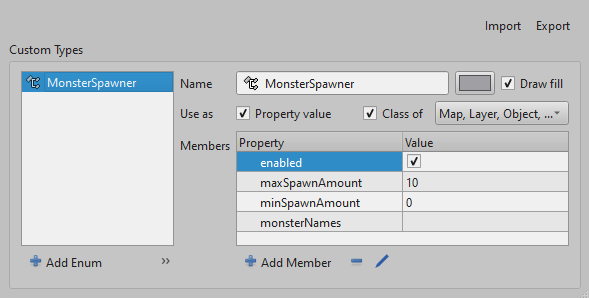
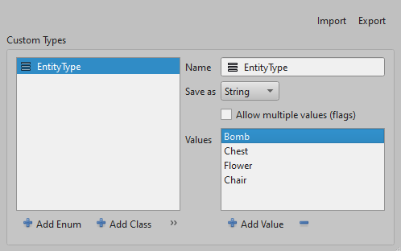

# Custom properties

[Tiled facilitates a very flexible way to store custom data in your maps using properties](https://doc.mapeditor.org/en/stable/manual/custom-properties/#custom-properties). Accessing these properties is a common task when working with Tiled maps in your game since it will allow you to fully utilize the strengths of Tiled, such as customizing the behavior of your game objects or setting up the initial state of your game world.

## All classes that can contain properties

All classes that can contain custom properties implement the interface <xref:DotTiled.Model.IHasProperties> in some way. Below is an exhaustive list of all classes that can contain custom properties:

- <xref:DotTiled.Model.BaseLayer> 
    - <xref:DotTiled.Model.TileLayer>
    - <xref:DotTiled.Model.ObjectLayer>
    - <xref:DotTiled.Model.ImageLayer>
    - <xref:DotTiled.Model.Group>
- <xref:DotTiled.Model.ClassProperty> (allows for recursive property objects)
- <xref:DotTiled.Model.CustomClassDefinition> (used to define custom Tiled property types)
- <xref:DotTiled.Model.Object>
    - <xref:DotTiled.Model.EllipseObject>
    - <xref:DotTiled.Model.PointObject>
    - <xref:DotTiled.Model.PolygonObject>
    - <xref:DotTiled.Model.PolylineObject>
    - <xref:DotTiled.Model.RectangleObject>
    - <xref:DotTiled.Model.TextObject>
    - <xref:DotTiled.Model.TileObject>
- <xref:DotTiled.Model.Tileset>
- <xref:DotTiled.Model.Tile>
- <xref:DotTiled.Model.WangTile>
- <xref:DotTiled.Model.WangColor>

## How to access properties

To access the properties on one of the classes listed above, you will make use of the <xref:DotTiled.Model.IHasProperties> interface.

In situations where you know that a property must exist, and you simply want to retrieve it, you can use the <xref:DotTiled.Model.IHasProperties.GetProperty``1(System.String)> method like so:

```csharp
var map = LoadMap();
var propertyValue = map.GetProperty<BoolProperty>("boolPropertyInMap").Value;
```

If you are unsure whether a property exists, or you want to provide some kind of default behaviour if the property is not present, you can instead use the <xref:DotTiled.Model.IHasProperties.TryGetProperty``1(System.String,``0@)> method like so:

```csharp
var map = LoadMap();
if (map.TryGetProperty<BoolProperty>("boolPropertyInMap", out var property))
{
  // Do something with existing property
  var propertyValue = property.Value;
}
else
{
  // Do something if property does not exist
}
```

For both methods, you can replace `BoolProperty` with any of the property types that Tiled supports. You can find a list of all property types and their corresponding classes in the [next section](#all-types-of-properties).

## All types of properties

Tiled supports a variety of property types, which are represented in the DotTiled library as classes that implement the <xref:DotTiled.Model.IProperty`1> interface. Below is a list of all property types that Tiled supports and their corresponding classes in DotTiled:

- `bool` - <xref:DotTiled.Model.BoolProperty>
- `color` - <xref:DotTiled.Model.ColorProperty>
- `float` - <xref:DotTiled.Model.FloatProperty>
- `file` - <xref:DotTiled.Model.FileProperty>
- `int` - <xref:DotTiled.Model.IntProperty>
- `object` - <xref:DotTiled.Model.ObjectProperty>
- `string` - <xref:DotTiled.Model.StringProperty>

In addition to these primitive property types, [Tiled also supports more complex property types](https://doc.mapeditor.org/en/stable/manual/custom-properties/#custom-types). These custom property types are defined in Tiled according to the linked documentation, and to work with them in DotTiled, you *must* define their equivalences as a <xref:DotTiled.Model.ICustomTypeDefinition>. You must then provide a resolving function to a defined type given a custom type name, as it is defined in Tiled.

## Custom types

Tiled allows you to define custom property types that can be used in your maps. These custom property types can be of type `class` or `enum`. DotTiled supports custom property types by allowing you to define the equivalent in C# and then providing a custom type resolver function that will return the equivalent definition given a custom type name.

### Class properties

Whenever DotTiled encounters a property that is of type `class` in a Tiled file, it will use the supplied custom type resolver function to retrieve the custom type definition. It will then use that definition to know the default values of the properties of that class, and then override those defaults with the values found in the Tiled file when populating a <xref:DotTiled.Model.ClassProperty> instance. `class` properties allow you to create hierarchical structures of properties.

For example, if you have a `class` property in Tiled that looks like this:



The equivalent definition in DotTiled would look like the following:

```csharp
var monsterSpawnerDefinition = new CustomClassDefinition
{
  Name = "MonsterSpawner",
  UseAs = CustomClassUseAs.All, // Not really validated by DotTiled
  Members = [ // Make sure that the default values match the Tiled UI
    new BoolProperty   { Name = "enabled",        Value = true },
    new IntProperty    { Name = "maxSpawnAmount", Value = 10 },
    new IntProperty    { Name = "minSpawnAmount", Value = 0 },
    new StringProperty { Name = "monsterNames",   Value = "" }
  ]
};
```

### Enum properties  

Tiled also allows you to define custom property types that work as enums. Similarly to `class` properties, you must define the equivalent in DotTiled as a <xref:DotTiled.Model.CustomEnumDefinition>. You can then return the corresponding definition in the resolving function.

For example, if you have a custom property type in Tiled that looks like this:



The equivalent definition in DotTiled would look like the following:

```csharp
var entityTypeDefinition = new CustomEnumDefinition
{
  Name = "EntityType",
  StorageType = CustomEnumStorageType.String,
  ValueAsFlags = false,
  Values = [
    "Bomb",
    "Chest",
    "Flower",
    "Chair"
  ]
};
```

### [Future] Automatically map custom property `class` types to C# classes

In the future, DotTiled will support automatically mapping custom property `class` types to C# classes. This will allow you to define a C# class that matches the structure of the `class` property in Tiled, and DotTiled will automatically map the properties of the `class` property to the properties of the C# class. This will make working with `class` properties much easier and more intuitive.

The idea is to expand on the <xref:DotTiled.Model.IHasProperties> interface with a method like `GetMappedProperty<T>(string propertyName)`, where `T` is a class that matches the structure of the `class` property in Tiled.

This functionality would be accompanied by a way to automatically create a matching <xref:DotTiled.Model.ICustomTypeDefinition> given a C# class or enum. Something like this would then be possible:

```csharp
class MonsterSpawner
{
  public bool Enabled { get; set; } = true;
  public int MaxSpawnAmount { get; set; } = 10;
  public int MinSpawnAmount { get; set; } = 0;
  public string MonsterNames { get; set; } = "";
}

enum EntityType
{
  Bomb,
  Chest,
  Flower,
  Chair
}

var monsterSpawnerDefinition = CustomClassDefinition.FromClass<MonsterSpawner>();
var entityTypeDefinition = CustomEnumDefinition.FromEnum<EntityType>();

// ...

var map = LoadMap();
var monsterSpawner = map.GetMappedProperty<MonsterSpawner>("monsterSpawnerPropertyInMap");
var entityType = map.GetMappedProperty<EntityType>("entityTypePropertyInMap");
```

Finally, it might be possible to also make some kind of exporting functionality for <xref:DotTiled.Model.ICustomTypeDefinition>. Given a collection of custom type definitions, DotTiled could generate a corresponding `propertytypes.json` file that you then can import into Tiled. This would make it so that you only have to define your custom property types once (in C#) and then import them into Tiled to use them in your maps.

Depending on implementation this might become something that can inhibit native AOT compilation due to potential reflection usage. Source generators could be used to mitigate this, but it is not yet clear how this will be implemented.