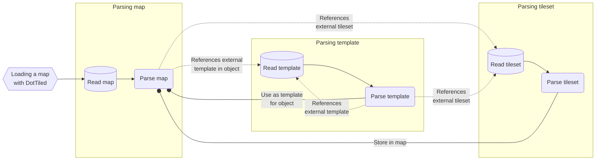

# Loading maps

Loading maps with DotTiled is very flexible and allows you as a developer to freely choose how you want to load your maps and tilesets. This guide will show you how to customize the loading process to fit your needs. As the tip below suggests, you can also use the quickstart guide if you just want to load maps from the filesystem without any particular customization.

> [!TIP]
> For a quick and easy way to load maps from the filesystem, please refer to the [quickstart guide](../quickstart.md).

## File formats

The <xref:DotTiled.Map> class is a representation of a Tiled map, mimicking the structure of a Tiled XML map file. Map files can either be in the [`.tmx`/XML](https://doc.mapeditor.org/en/stable/reference/tmx-map-format/) or [`.tmj`/json](https://doc.mapeditor.org/en/stable/reference/json-map-format/) format. DotTiled supports **both** formats fully.

## The process of loading a map

Loading a map with DotTiled is not a complex process, but one that at least demands a basic understanding of how Tiled maps are structured. The process can be broken down into the following flow(-ish) chart:



As you can see, the process is quite simple. You read the map, parse it, and then read and parse any external tilesets or templates that are referenced in the map. The tilesets and templates are then stored in the map object that is returned to you.

However, because DotTiled works in the way that it does, you will need to provide a way to resolve these external resources. We'll go through how to do that in the next section.

## Loading a map with <xref:DotTiled.Serialization.Loader>

When using <xref:DotTiled.Serialization.Loader>, external resources like tilesets and templates will be resolved by the loader itself. Since Tiled saves the external resource paths relative to the map file, the loader will automatically resolve these paths and use the provided <xref:DotTiled.Serialization.IResourceReader> to read the external resources. Therefore, as long as the external resources are accessible in a "relative path" way using the provided <xref:DotTiled.Serialization.IResourceReader>, you don't have to worry about resolving them yourself.

```xml
<?xml version="1.0" encoding="UTF-8"?>
<map version="1.10" tiledversion="1.11.0" orientation="orthogonal" renderorder="right-down" width="5" height="5" tilewidth="32" tileheight="32" infinite="0" nextlayerid="2" nextobjectid="1">
 <tileset firstgid="1" source="tileset.tsx"/>
 <layer id="1" name="Tile Layer 1" width="5" height="5">
  <data encoding="csv">
1,1,0,0,7,
1,1,0,0,7,
0,0,1,0,7,
0,0,0,1,7,
21,21,21,21,1
</data>
 </layer>
</map>
```

A map like the one above that is loaded by the following code will result in the loader calling `IResourceReader.Read("path/to/tileset.tsx")` to read the external tileset, since it will use the path relative to the map file to resolve the tileset.

```csharp
var loader = Loader.Default();
var map = loader.LoadMap("path/to/map.tmx");
```

Additionally, the loader will use an in-memory cache to avoid loading the same tileset or template multiple times. This is done using the <xref:DotTiled.Serialization.IResourceCache> that is provided to the loader. If you don't provide a cache, the loader will use the <xref:DotTiled.Serialization.DefaultResourceCache> by default.

## Loading a map manually with <xref:DotTiled.Serialization.MapReader>

While it is recommended to use the <xref:DotTiled.Serialization.Loader> class to perform the loading of maps and tilesets, you may have certain requirements that necessitate you to load maps in a more manual way. This section will guide you through how to load a map manually without the use of the provided loader.

### <xref:DotTiled.Serialization.MapReader>, <xref:DotTiled.Serialization.TilesetReader>, and <xref:DotTiled.Serialization.TemplateReader>

are the three classes that you will use to read the map, tileset, and template, respectively. They are designed to be used in a way that you can provide your own resolver functions to load external resources.

> [!IMPORTANT]
> The resolving functions will get the source path of the external resource as a parameter, _in the exact way it is written in the map file_. You will have to perform your own path resolution to load the external resources.

### `Func<string, Tileset>` - Tileset resolver

This function is used to resolve external tilesets by their source path. The function should return a <xref:DotTiled.Tileset> instance given the source path of the tileset. If you just want to load tilesets from the file system, you can use something like this:

```csharp
Tileset ResolveTileset(string source)
{
  using var tilesetFileReader = new StreamReader(source);
  var tilesetString = tilesetFileReader.ReadToEnd();
  using var tilesetReader = new TilesetReader(tilesetString, ResolveTileset, ResolveTemplate, ResolveCustomType);
  return tilesetReader.ReadTileset();
}
```

But, DotTiled is designed this way so you can retrieve your external resources from anywhere, such as a database or a custom file format, by implementing your own resolver function however you like. If you have some other means of accessing resources, you can use that instead of the file system.

```csharp
Tileset ResolveTileset(string source)
{
  var tilesetString = ContentManager.GetString($"tilesets/{source}");
  using var tilesetReader = new TilesetReader(tilesetString, ResolveTileset, ResolveTemplate, ResolveCustomType);
  return tilesetReader.ReadTileset();
}
```

### `Func<string, Template>` - Template resolver

This function is used to resolve external object templates by their source path. The function should return a <xref:DotTiled.Template> instance given the source path of the template. If you just want to load templates from the file system, you can use something very similar to the example tileset resolver by replacing <xref:DotTiled.Serialization.TilesetReader> with <xref:DotTiled.Serialization.TemplateReader>.

### `Func<string, ICustomTypeDefinition>` - Custom type resolver

This function is used to resolve custom types that are defined in your Tiled maps. Please refer to the [custom properties](custom-properties.md) documentation for more information on custom types. The function should return a <xref:DotTiled.ICustomTypeDefinition> instance given the custom type's name.

## Putting it all together

The following classes are the readers that you will need to use to read the map, tileset, and template: <xref:DotTiled.Serialization.MapReader>, <xref:DotTiled.Serialization.TilesetReader>, and <xref:DotTiled.Serialization.TemplateReader>.

Here is an example of how you can load a map with DotTiled, and is very similar to how the <xref:DotTiled.Serialization.Loader> class works:

```csharp
string mapPath = "path/to/map.tmx";
string mapDirectory = Path.GetDirectoryName(mapPath);

Tileset ResolveTileset(string source)
{
  string tilesetPath = Path.Combine(mapDirectory, source);
  using var tilesetFileReader = new StreamReader(tilesetPath);
  var tilesetString = tilesetFileReader.ReadToEnd();
  using var tilesetReader = new TilesetReader(tilesetString, ResolveTileset, ResolveTemplate, ResolveCustomType);
  return tilesetReader.ReadTileset();
}

Template ResolveTemplate(string source)
{
  string templatePath = Path.Combine(mapDirectory, source);
  using var templateFileReader = new StreamReader(templatePath);
  var templateString = templateFileReader.ReadToEnd();
  using var templateReader = new TemplateReader(templateString, ResolveTileset, ResolveTemplate, ResolveCustomType);
  return templateReader.ReadTemplate();
}

Optional<ICustomTypeDefinition> ResolveCustomType(string name)
{
  var allDefinedTypes = [ ... ];
  return allDefinedTypes.FirstOrDefault(type => type.Name == name);
}

using var mapFileReader = new StreamReader(mapPath);
var mapString = mapFileReader.ReadToEnd();
using var mapReader = new MapReader(mapString, ResolveTileset, ResolveTemplate, ResolveCustomType);

var map = mapReader.ReadMap();
```
