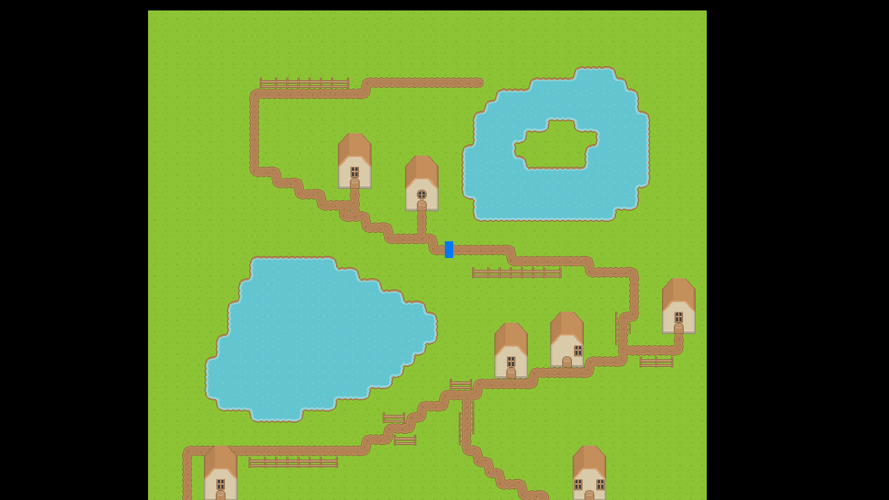
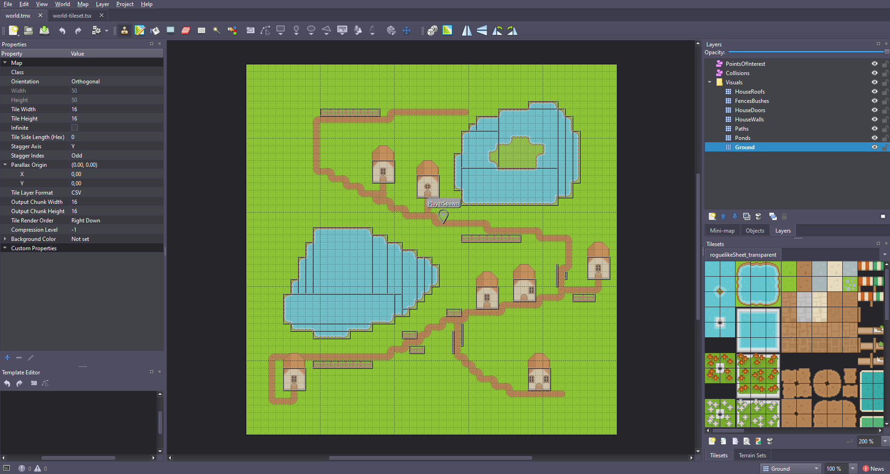

# DotTiled Example with Raylib

This project demonstrates how to use the [DotTiled](https://github.com/dot-tiled/dot-tiled) library to load and render Tiled maps in a game using [Raylib](https://www.raylib.com/). It is designed to be beginner-friendly and serves as a starting point for anyone looking to integrate Tiled maps into their games.

<p>
    
    
</p>

### How It Works

This example project loads a Tiled map (`world.tmx`), renders its layers, and allows basic player movement with collision detection. The project is structured to prioritize readability and ease of understanding.

#### Key Features:
1. **Loading Tiled Maps**: Uses DotTiled to parse `.tmx` files and extract map data.
2. **Rendering Layers**: Renders specific layers (e.g., ground, objects, roofs) using Raylib.
3. **Player Movement**: Handles player input and updates the player's position.
4. **Collision Detection**: Prevents the player from moving through objects defined in the collision layer.
5. **Camera Tracking**: Smoothly follows the player as they move.

### Map Structure

The Tiled map (`world.tmx`) is structured into different types of layers to organize the game world:

1. **Tile Layers (Visuals)**:
   - These layers define the visual elements of the map, such as the ground, paths, ponds, walls, and roofs.
   - Each layer is rendered in a specific order to ensure that the player appears between certain layers (e.g., under roofs but above the ground).

2. **Object Layers (Collisions)**:
    - These layers define areas where the player cannot move, such as walls or obstacles.
    - Each object in the layer is represented as a rectangle, and collision detection is performed against these objects.

3. **Object Layer (Player Spawn)**:
    - This layer contains a single point object that defines the player's starting position.
    - The object is named `PlayerSpawn` and is used to initialize the player's position in the game.

This is just one way to structure a map for use with DotTiled. As you become more comfortable with Tiled and DotTiled, you can experiment with different layer types and configurations to suit your game's needs.

### Project Structure

Main Components:

- `Main` **Method**: Initializes the game window, loads the map, and runs the main game loop.
- `Update` **Method**: Handles player movement, collision detection, and camera updates.
- `Render` **Method**: Draws the map layers and the player.

### Code Walkthrough

1. **Loading the Map**

    The map is loaded using DotTiled's `Loader` class. The `world.tmx` file is located in the [assets](assets/) folder.

    ```csharp
    var loader = Loader.Default();
    var map = loader.LoadMap("assets/world.tmx");
    ```

2. **Rendering Layers**

    The `RenderLayers` method renders specific layers from the map. For example, the ground and paths are rendered below the player, while roofs are rendered above.

    ```csharp
    RenderLayers(map, visualLayers, tilesetTextures, new[] { "Ground", "Ponds", "Paths" });
    ```

3. **Player Movement**

    Player movement is handled in the `HandlePlayerInput` method. The `W`, `A`, `S`, and `D` keys are used to move the player.

4. **Collision Detection**

    The `Update` method checks for collisions between the player and objects in the collision layer. If a collision is detected, the player's movement is stopped.

    ```csharp
    if (Raylib.CheckCollisionRecs(movePlayerHRect, objRect)) move.X = 0;
    if (Raylib.CheckCollisionRecs(movePlayerVRect, objRect)) move.Y = 0;
    ```

5. **Camera Tracking**

    The camera smoothly follows the player using linear interpolation.

    ```csharp
    camera.Target += (newCameraTarget - camera.Target) * 15f * Raylib.GetFrameTime();
    ```

### Replacing Raylib with another library or framework

If you want to replace Raylib with another library or framework, you will need to modify the rendering and input handling code. The core logic for loading and parsing the Tiled map using DotTiled will remain the same.

1. **Window initialization**: 
    
    Replace the Raylib window initialization with the equivalent code for your chosen library or framework.

2. **Rendering**:

    Modify the rendering code to use the graphics API of your chosen library. This includes loading textures, drawing sprites, and handling camera transformations.

    For example, replace this tile rendering draw call with the equivalent in your library:

    ```csharp
    Raylib.DrawTexturePro(
        tilesetTextures[tileset.Image.Value.Source.Value],
        raylibSourceRect,
        destinationRect,
        Vector2.Zero,
        0,
        RayColor.White
    );
    ```

3. **Input handling**:

    Replace the Raylib input handling code with the equivalent code for your chosen library. This includes checking for key presses or similar.

### Running the Example

1. Clone this repository
2. Navigate to the `DotTiled.Example.Raylib` directory.
3. Run the project using your preferred IDE or command line tool.
    - `dotnet run` (if using .NET CLI)
    - Open the project in your IDE of choice and run it from there.